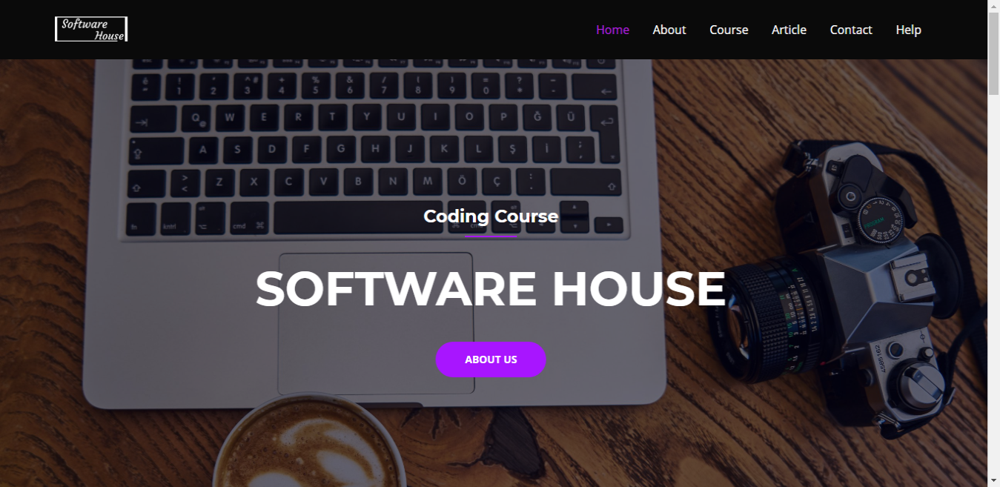
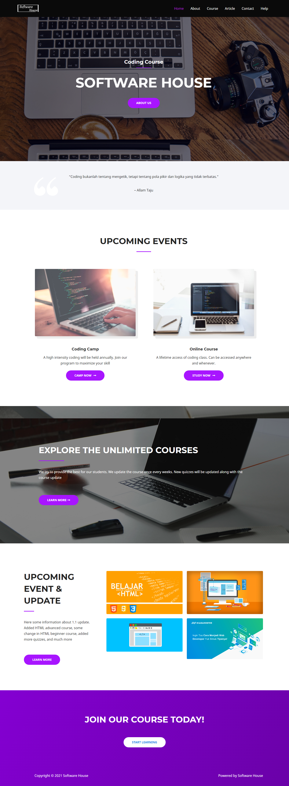
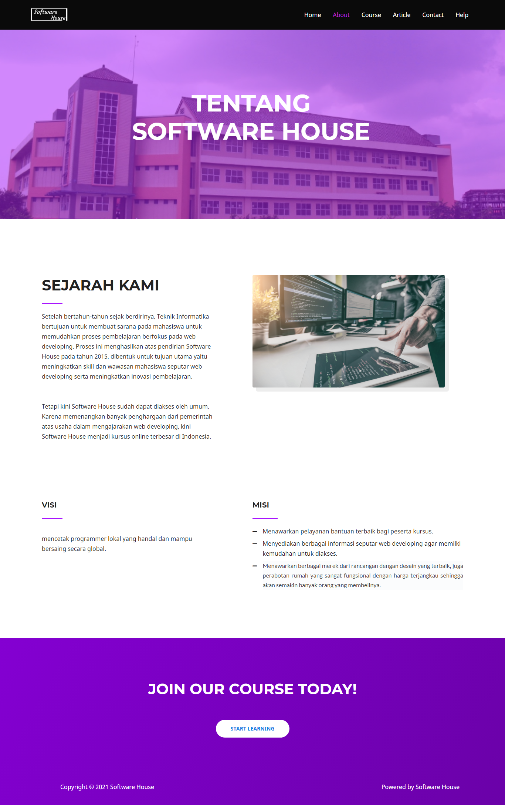
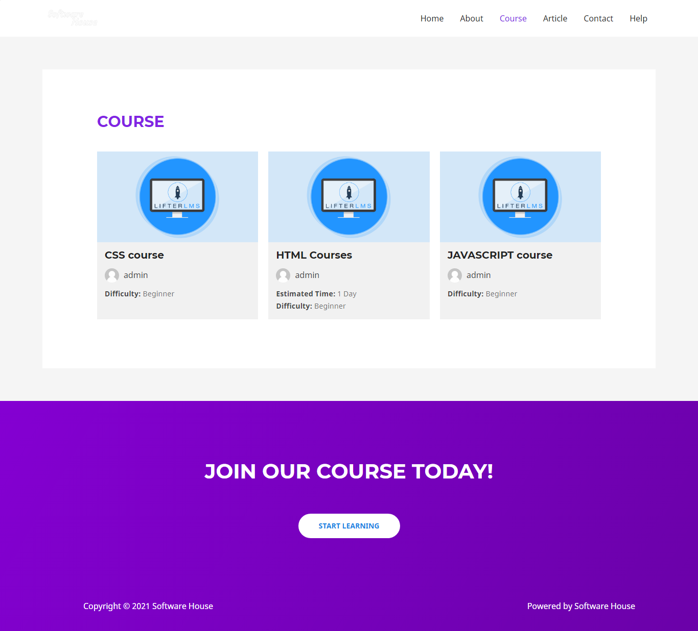
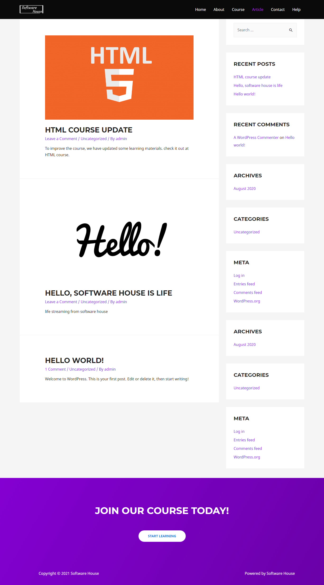
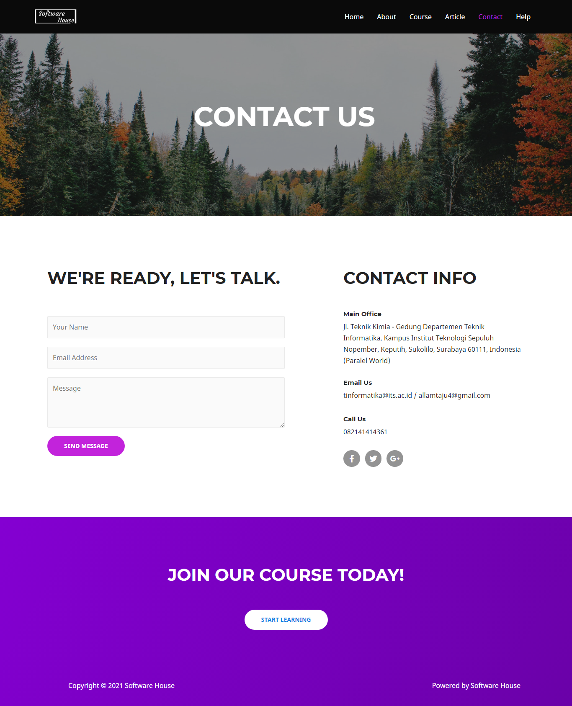
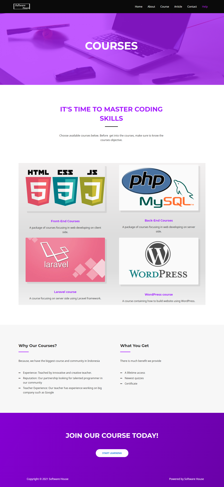
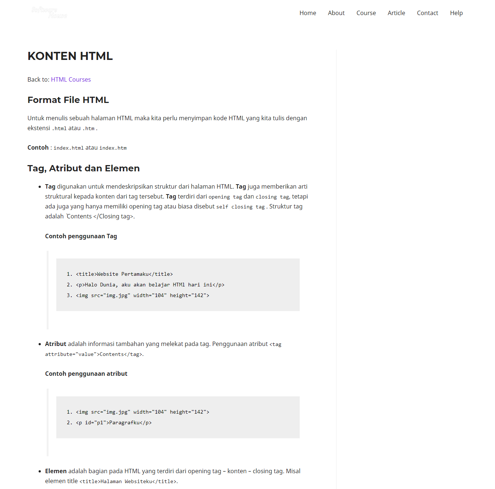
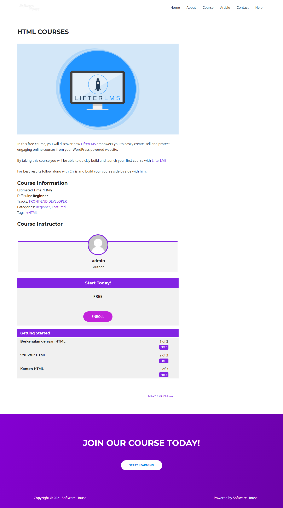

# ☕️ Online Course based Wordpress
    

****
### 💡Judul : Sofware House 
### 💡Jenis : Course Web App 
****

## Deskripsi Web 📌 
Web ini adalah sebuah course online berbasis web yang dibangun menggunakan wordpress.
Web ini juga menggunakan beberapa plug-in, antara lain:
1. Elementor
  Elementor adalah plug-in yang saya gunakan untuk mengedit tata letak pada web ini.
  Penggunaan Elementor ada pada semua page kecuali page article dan course.
2. Lifter LMS
  Untuk mengatur course saya menggunakan Lifter LMS. Plug-in ini saya gunakan pada page course
  sehingga tata letak dan manajemen pada page course menggunakan plug-in ini dan bukan elementor.
3. Astra theme
  Tema yang digunakan pada web ini adalah astra. karena sangat mudah saat digabung dengan Elementor.
  Serta pengaturan navbar yang mudah.

****  
📗 Web:  
  Halaman awal (Home)
  
  Halaman About
  
  Halaman Course
  
  Halaman Article
  
  Halaman Contact
  
  Halaman Help
  
  
  Konten Course
  
  -->
  

  
**** 
